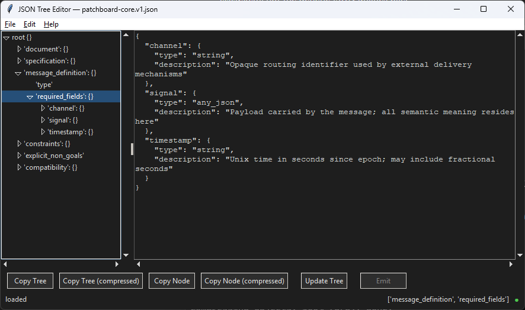

# jsonedit

A lightweight JSON tree editor built with Python + Tkinter.

## Screenshot



## Install

```bash
pip install jsonedit
```

## Run

```bash
jsonedit
```

You can also open a file directly:

```bash
jsonedit <filepath>
```

## Features

- Tree view + text editor side by side
- Safe editing with explicit commit (Ctrl+Enter / Update Tree)
- Search keys and repeat search
- Copy full document or selected subtree (pretty or compact)
- Dark theme

## Notes

- This is a GUI app; it requires a working Tkinter install.
- Edits in the text pane are not applied until you commit them.

## License

MIT. See `LICENSE`.
